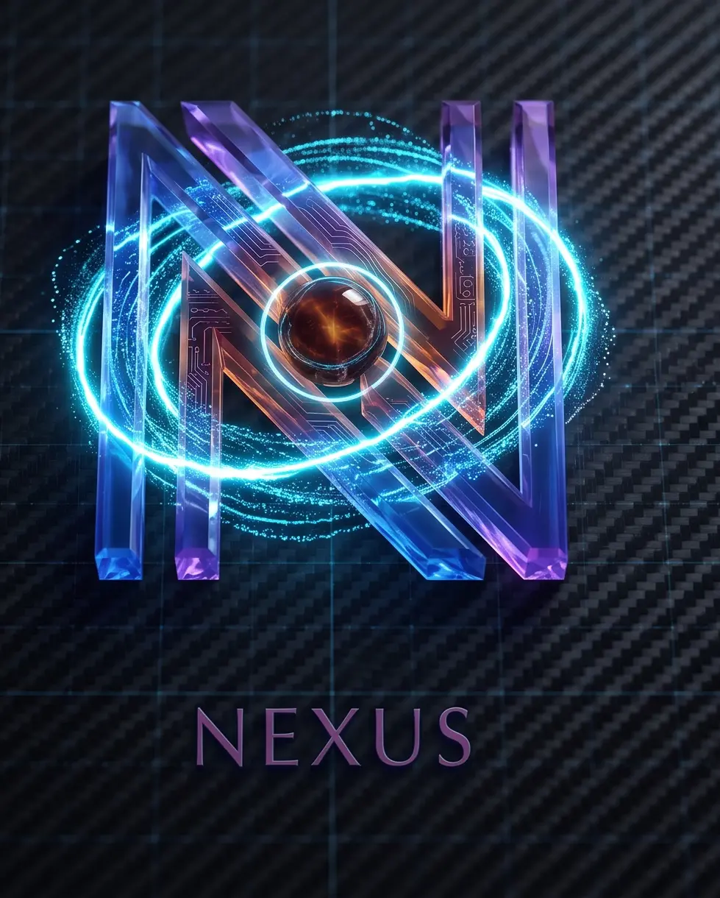

<div align="center">



# Nexus · Psicólogo IA

Chatbot psicólogo con frontend 3D, pétalos interactivos y backend sobre n8n.

Frontend puro (HTML + Tailwind + Canvas) · Backend n8n · Cualquier modelo vía API OpenAI-compatible

</div>

---

## ✨ Características

### Frontend
- 🌸 **Pétalos 3D interactivos** — caen de dos árboles SVG, huyen del cursor y se multiplican al mover el ratón
- 🌙 **Dark mode por defecto** + light mode con un clic (persistente en localStorage)
- 🎬 **Animaciones solo en hover** — nada se mueve solo: el logo gira 360°, las burbujas salen en 3D, botones con tilt y ripple
- 💬 Chat con burbujas glassmorphism, indicador de escritura, chips de sugerencia
- 🛡️ Protegido contra XSS, timeout de 90s con mensajes en personaje
- ⚡ Tailwind CSS compilado localmente (sin CDN) — carga rápida y funciona offline

### Backend (workflow de n8n)
- 🧠 **Memoria de conversación** por sesión — 24 mensajes, expira a las 24h, persiste en BD (sobrevive reinicios)
- 💰 **Presupuesto diario de tokens** (1M por defecto) — al superarlo responde en 0.2s gastando 0 tokens
- 🔁 **Modelo de fallback** — si el principal falla tras 2 reintentos, responde el secundario automáticamente
- 🔐 **Webhook protegido por secreto** — peticiones no autorizadas rechazadas antes de gastar nada
- ⚙️ **Todo configurable desde un nodo** — API key, modelo, fallback y personalidad

## 🏗️ Arquitectura

```
Navegador (index.html)
   │  POST /webhook/.../chat  { chatInput, sessionId, auth }
   ▼
n8n: Chat Trigger → Verificar Acceso → Configuracion IA → Memoria (+presupuesto diario)
   → Presupuesto OK? ─┬─ OK → Llamada al modelo (retry ×2) → Respuesta OK? ─┬─ OK → Guardar Respuesta → Respuesta al Chat
                       │                                                 └─ fallo → Llamada Fallback ─┘
                       └─ excedido → "necesito descansar" (0 tokens)
```

Funciona con cualquier endpoint `/v1/chat/completions` compatible con OpenAI: **OpenRouter, Groq, OpenAI, Ollama local...**

## 🚀 Puesta en marcha

### Frontend

```bash
git clone https://github.com/Meliodas-96/psicologist-nexus.git
cd psicologist-nexus
cp .env.example .env      # edita con tu webhook y secreto
npm install
npm run build             # genera config.js desde .env
```

Abre `index.html` en el navegador — no necesita servidor.

### Deploy en Vercel

1. Haz push del repo a GitHub
2. Vercel → **Add New Project** → importa el repo
3. **Settings → Environment Variables**:
   - `WEBHOOK_URL` → URL del webhook de tu n8n
   - `CHAT_SECRET` → el mismo secreto del nodo "Verificar Acceso"
4. Deploy — Vercel ejecuta `npm run build` automáticamente

### Backend (n8n)

1. Importa `nexus-workflow.json` en tu instancia de n8n
2. Nodo **Configuracion IA**:
   - `apiKey` → tu API key del proveedor
   - `model` → modelo principal (ej: `deepseek/deepseek-v4-flash`)
   - `fallbackModel` → modelo de emergencia (ej: `minimax/minimax-m3`)
   - `systemPrompt` → personalidad del bot
3. Nodo **Verificar Acceso** → cambia `SECRET` al mismo valor que `CHAT_SECRET`
4. (Opcional) Nodo **Memoria** → ajusta `MAX_DAILY_TOKENS` y `MAX_MESSAGES`
5. Activa el workflow y copia la URL del webhook a tu `.env` (`WEBHOOK_URL`)

## 📁 Estructura

```
├── index.html               # Estructura (Tailwind + logo + árboles SVG)
├── app.js                   # Lógica del chat, tema, tilt 3D, ripple
├── background.js            # Motor de pétalos (canvas, física, interacción)
├── styles.css               # Tailwind compilado + efectos custom
├── src/
│   ├── input.css            # Fuente del CSS (editar y recompilar)
│   └── Logo.webp            # Logo
├── scripts/build-config.js  # Genera config.js desde .env / env vars
├── package.json             # npm run build
├── vercel.json              # Deploy estático en Vercel
├── .env.example             # Plantilla de variables
├── .env                     # Secretos reales (gitignored)
└── config.js                # Generado por build (gitignored)
```

Recompilar el CSS tras editar `src/input.css`:

```bash
npx tailwindcss@3.4.17 -i src/input.css -o styles.css --minify
```

## 🎨 Personalizar

| Qué | Dónde |
|---|---|
| Personalidad del bot | `systemPrompt` en nodo **Configuracion IA** |
| Modelo / fallback | `model` / `fallbackModel` en el mismo nodo |
| Presupuesto diario | `MAX_DAILY_TOKENS` en nodo **Memoria** |
| Mensajes recordados | `MAX_MESSAGES` en nodo **Memoria** |
| Colores de pétalos | `PALETTES` en `background.js` |
| Cantidad de pétalos | `BASE_COUNT` / `MAX_COUNT` en `background.js` |

## 🔒 Seguridad

- Los secretos viven en `.env` (gitignored) y dentro del workflow de n8n
- El webhook rechaza peticiones sin secreto **antes** de gastar tokens
- La API key del proveedor de modelos nunca sale de n8n
- `npm run build` genera el `config.js` en cada deploy — nunca se commitea

> Nota: al ser un frontend puro, el secreto del chat es visible en el código fuente del navegador. Bloquea uso casual/abusivo; para blindaje total haría falta un proxy backend.

## 📄 Licencia

MIT
